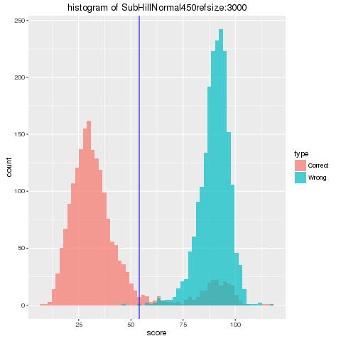
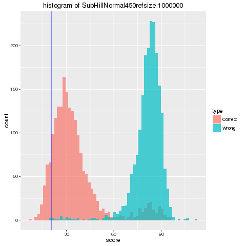

#2017-10-15

## Aim

+ To find argmin(P(h)/C(h)), where P(h) = Pr({X<h|dtw to wrong position}),C(h) = Pr({X<h|dtw to correct position}()

## What for

+ To determine the threashold by which we use to distinguish given read.

## Assumed Result

+ だいたいヒストグラムから推定できる。できるだけCorrectは多く取って、できるだけWrongは少なく取りたい。累積密度の比が最低になる場所になる。

## Method

+ Sort -> Merge でいける（簡単なので省略）
+ 本来は、ランダムスコアを正規分布で推定して、コレクトスコアをランダムスコアと何かの混合ガウス分布で推定して……と言った手続きを取るべきだが、面倒だし、きっと性能は上がらないし、第一、explicitに累積分布が計算できるので、しない。
+ じっさいは、P/Cはhについてnが大きいとき凸になり、最適化が容易だが、どこで最低値を取るかくらいは分かるので、exhaustive searchをかける。こちらのほうが簡単だし早い。

+ 2017-12-09更新：ネガティブデータは単純なガウス分布で、ポジティブデータはn=2の混合ガウス分布で推定することにする。更新は適当なところで打ち切る。アルゴリズムとしてはEMアルゴリズムを用いる。
+ 密度を推定したあとで、

## Data

+ knnで用いたデータを流用する（こういうことをすると、レポジトリがself-consistentではなくなるので、あんまりしたくないが……）

## Result

+ 大体"良さそう"なスレッショルドを与えている。

しかし、一方でコンサーバティブすぎるスレッショルドを与える可能性もある

これは、クライテリアを一般化することで用意にどうにかなる問題なので、ここでは深く書かない。